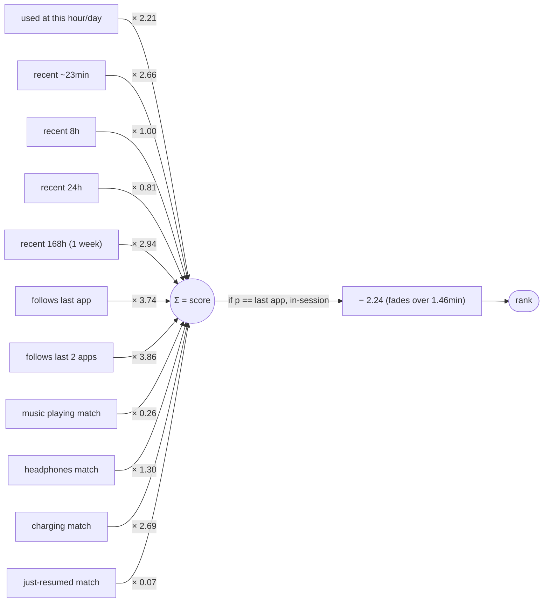

# Loom — how an app gets its score

## Simple version

```mermaid
flowchart LR
  subgraph IN["11 signals per app"]
    direction TB
    S1["used at this hour/day"]
    S2["recent (~23min curve)"]
    S3["recent (8h curve)"]
    S4["recent (24h curve)"]
    S5["recent (1 week curve)"]
    S6["follows last app"]
    S7["follows last 2 apps"]
    S8["music playing match"]
    S9["headphones match"]
    S10["charging match"]
    S11["just-resumed match"]
  end

  IN -- "weighted sum<br/>(each signal ÷ max)" --> SUM(("score"))
  SUM -- "if same as last app<br/>in current session" --> PEN["− self-loop penalty"]
  PEN --> OUT(["final score → rank"])
```

## With the weights (v3, tuned by Optuna on 1000 events)

Four rules:
- Every signal is scaled to **[0..1] across all apps** before multiplying by its weight, so weights are directly comparable.
- The 4 ctx signals (music/headphones/charging/resume) only apply when launcher captures live context — old events without ctx drop out cleanly.
- The penalty only fires for the just-launched app while still in-session (anti "Chrome→Chrome" bias).
- Before scoring, **burst-collapse**: consecutive same-app events within 60s are merged into one to clean up rapid re-launches.

Performance: @1 = 24.13%, MRR = 0.4039 (walk-forward CV on 1000 events).
